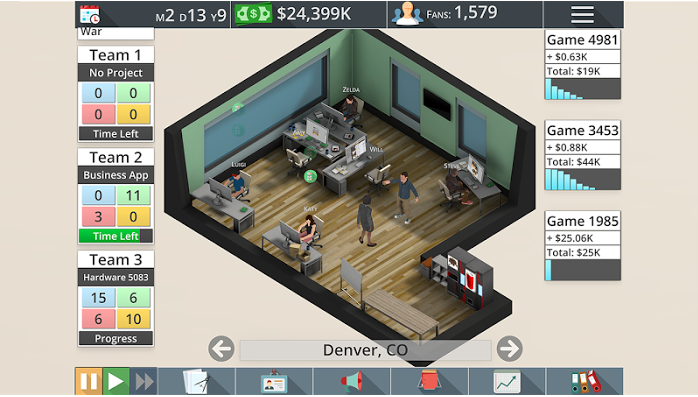
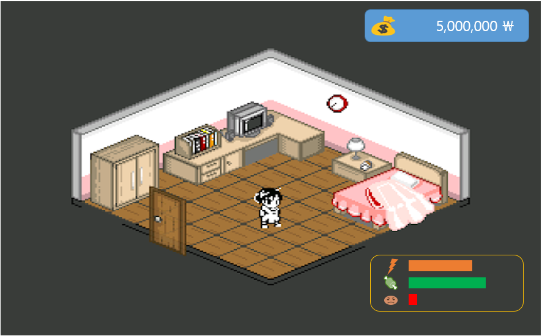
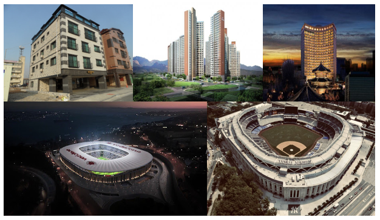
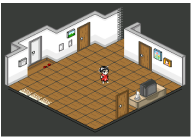
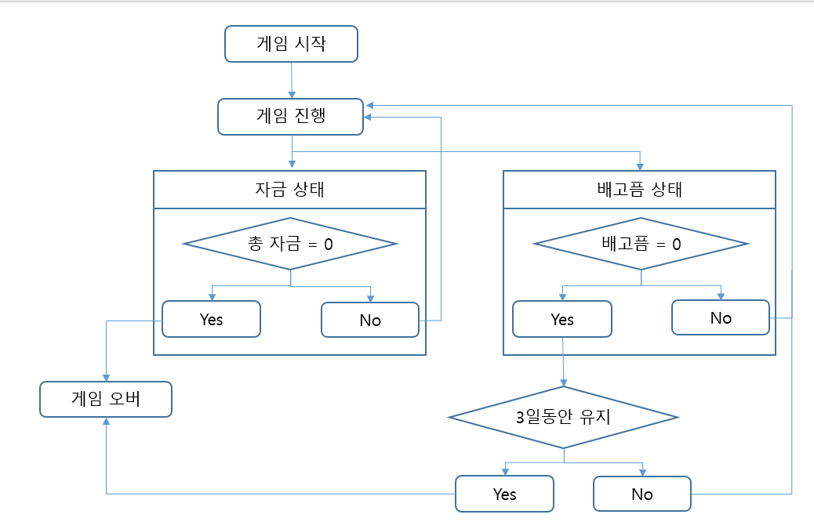
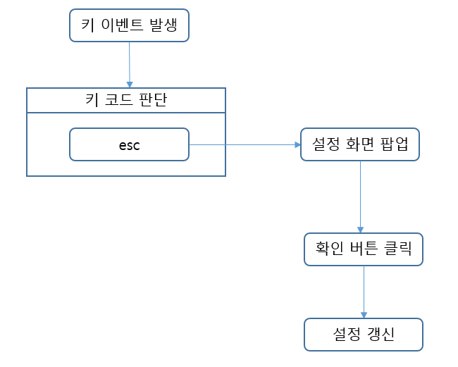

# 투자자로 성공하기

# [ 목차 ]
### 1. [게임명: 투자자로 성공하기]
### 2. [컨셉](#1)
### 3. [관련 이미지와 동영상](#2)
### 4. [대표 이미지](#3)
### 5. [컨셉과 대표이미지 기반 작품 묘사](#4)
### 6. [투자자로 성공하기의 구성 요소](#5)
### 7. [게임 시스템 디자인](#6)
#### a. 게임 오브젝트 분해 (#6.1)
#### b. 파라미터 
#### c. 행동 
#### d. 상태 
#### e. 플레이어 캐릭터 속성(파라미터) 
#### f. 게임의 규칙 
#### g. 게임에서 사용될 규칙 
### 8. [요구사항](#7)
### 9. [시간별 흐름도](#8)
### 10. [키보드 이벤트에 대한 흐름도](#9)

# 2. [컨셉] 

## 메인컨셉 : 투자 (Investment)

- 코로나 19이슈로 인해 암호화폐 시장(비트코인), 주식등의 금융투자를 하는 사람들이 늘어나며이에 대한 정보나 지식등을 배울 수 있게 함.

- 솔로 플레이를 지향하여 개발

- 본인이 원하는 방향대로 투자를 하며 자금력을 키워나감

- 장르: 시뮬레이션

### 서브 컨셉 1 : 시뮬레이션(Simulation)

- 시뮬레이션은 ‘이런 식으로 진행하면 어떨까?’ 라는 if의 성격이 강함

- 자유도가 높기에 플레이어 취향대로 할 수 있는 특성이 존재

### 서브 컨셉 2 : 돈 (Money)

- 투자를 통해 돈을 벌 수 있으며 번 돈을 통해 다른 사업에 투자를 하며 안정적인 이익실현을 할 수 있음

### 서브 컨셉 3 : 자유(Liberty)

- 시뮬레이션 게임 특성 중 하나이며 최대 장점 중 하나

- 하나의 방법으로 진행 한 이후 다른 방법으로 게임을 진행하며 게임의 신선함을 추구

### 서브 컨셉 4 : 건설 (build)

- 투자한 돈을 통해 땅을 사고 구입한 땅에 건물을 올려 또 다른 이익을 취할 수 있다. 

  

# 3. [관련 이미지 & 동영상] 

- 이미지  
  
- 동영상
  

  

# 4. [대표 이미지] 

  

# 5. [컨셉 & 대표이미지 기반 작품묘사] 

> ### 대표이미지 기반 :
 

> ### 컨셉 기반:

  

# 6. [<투자자로 성공하기> 구성 요소] 

- 투자를 통해 부자가 되어보자

 

## 6-1. 메커니즘

[도전 과제]

1. 주식, 암호 화폐 거래 등을 통해 돈을 확보한다.

2. 확보한 자금을 통해 건물을 짓고 자본을 증가 시킨다.

[재미 요소]

1. 다른 게임들과 달리 자본이 올라갈 수도 있고 내려갈 수 도 있다.
2. 필요하다면 은행에서 대출을 하여 대출금을 통해 투자를 유치 할 수 있다.
   하지만 대출 상환기간까지 대출금을 갚지 못한다면 강제적으로 대출한 금액과 같은
   가치를 건물 등을 압수한다.
3. 소지한 금액, 건물 모두 0이고 대출금까지 갚지를 못한다면, 파산으로 이어지며 
파산시 게임이 종료가 된다. 
4. 투자를 하고 난 후 변동 되는 투자 금액은 다음 날 확인 할 수 있다.
5. 캐릭터에게 스테이터스를 주어 다른 요소에서도 돈이 빠져나갈 수 있게끔 유도한다.
6. 만일 특정 스테이터스가 일정 수치로 떨어지면 플레이어의 체력이 떨어지기 시작하며
체력이 모두 소모되면 그 즉시 게임을 종료 시킨다.

 

## 6-2. 이야기

[기획 의도]  
코로나 19이슈로 인해 주식, 암호화폐등에 대해 사람들이 많은 관심을 가지게 되고 이러한 경제 활동을 꺼려하고 다가가기 힘들어 하는 사람을 주위에서 쉽게 볼 수 있었다. 
이런 사람들에게 부담 되지 않게 활동 등을 알려주며 간단하게 즐길 수 있게 만들어 보고 싶어서 기획하게 되었다.

[세계관]  
일만 하면서 돈을 벌어 왔던 플레이어가 친구에게 일을 하지 않아도 돈을 벌 수 있다는 솔깃한 이야기를 듣게 되었다. 
플레이어는 ‘워렌 버핏’과 같은 최고의 투자자가 되기 위해 회사를 그만두고 투자에만 몰두하게 된다.

 

## 6-3. 미적요소

[디자인][컬러]  
방 배경, 도시 배경을 제작하고 방 배경화면에서는 주식, 암호화폐 거래등의 투자활동, 대출, 세금납부, 우편물 등의 UI를 제작하여 투자 활동을 할 수 있게 한다.
도시 배경에서는 빌딩, 주택, 백화점, 축구장, 야구장 등등 여러 다채로운 건물들을 디자인하여 본인의 마음대로 건물을 올릴 수 있는 재미를 줄 것이다.

[음향]  
평화로운 배경음악을 주로 틀어주고 각 상황에 맞는 효과음을 삽입하여 몰입감을 유도한다.
 

## 6-4. 기술

Unity엔진을 이용하여 제작합니다. 모바일, pc모두 구동이 가능하게 제작을 할 것입니다. 
다른 pc게임처럼 사양이 높게 나오진 않겠지만 간단하고 가볍게 재밌게 즐길 수 있는 게임을 개발 할 것입니다.

# 7.[ 게임 시스템 디자인 ] 
## a. 게임 오브젝트 분해

|연번|오브젝트 이름|오브젝트 이미지|
|---|---|---|
|1|건물||
|2|음식||
|3|방 내부||
|4|활동||

## b. 파라미터

### b-1. 건물

|속성|영문명칭|설명|
|---|---|---|
|원룸 건물|Studio_apartment|대학생이나 공시생들이 살 수 있는 곳|
|아파트|Apartment|주민들이 살 수 있는 곳|
|축구장|Soccer_field|축구경기를 관람 할 수 있는 곳|
|야구장|Baseball_field|야구경기를 관람 할 수 있는 곳|
|스포츠센터|Sports_center|실내스포츠와 같은 다양한 스포츠를 즐길 수 있는 곳|
|상가|Strip_Mall|다양한 상정들이 있는 곳|
|호텔|Hotel|여행객들이 묵어가는 곳|

|속성|영문명칭|설명|
|---|---|---|
|건물 가치|b_price| 건물 생산에 필요한 가격이자 건물의 가치이다|
|건물 수입|b_import| 건물이 주기적으로 벌어들이는 수입|
|건설 시간|b_time| 건물을 건설하는데 걸리는 시간|

### b-2. 음식

|속성|영문명칭|설명|
|---|---|---|
|볶음밥|BokkeuBob|각종 야채와 밥을 볶은 음식|
|짜장면|JJaJangmyeon|중화요리 대표 음식중 하나. 춘장과 야채, 고기를 볶아 국수에 비벼먹는 음식|
|짬뽕|JJamBBong|중화요리 대표 음식중 하나. 야채와 김치 등을 넣고 끓인 음식 |
|삼겹살|Samkyubsal|돼지고기를 불에 구운 음식|
|김치찌개|Kimchi_JJigae|야채와 김치등을 넣고 끓인 음식|
|파스타|Pasta|이탈리아의 면을 이용한 음식|
|라멘|Ramen|육수를 오래 우려낸 일본식 라멘|

|속성|영문명칭|설명|
|---|---|---|
|음식의 가격|F_price|음식을 먹기위해 소비해야하는 돈이다.|
|포만감|F_starve| 음식을 먹으면 배고픔 수치가 올라간다.|

### b-3. 방 내부

|속성|영문명칭|설명|
|---|---|---|
|컴퓨터|Computer|투자활동이나 메일을 볼 수 있다.|
|침대|bed|침대에 누워 잠을 청할 수 있다.|
|식사 메뉴|Meal_Menu|원하는 음식을 시켜 밥을 먹을 수 있다.|
|활동 메뉴|Activate_Menu|원하는 활동을 할 수 있다.|

### b-4. 활동 아이콘

|속성|영문명칭|설명|
|---|---|---|
|운동|Exercise|간단한 운동을 한다.|
|산책|Walk|집 주변을 돌며 산책한다.|
|영화 감상| Movie|영화를 감상한다.|
|독서| Read| 책을 읽는다.|

## c. 행동

### c-1. 캐릭터(PC/NPC)

|행동|설명|
|---|---|
|대기|캐릭터가 아무것도 하지않는 상태를 뜻하며 정처없이 방안을 돌아다닌다.|
|투자활동|캐릭터가 의자에 앉아 컴퓨터를 사용한다.|
|식사|식탁에 앉아 음식을 먹는다.|
|자기|침대에 누워 잠을 청한다.|
|책읽기|식탁에 앉아 책을 읽는다.|
|영화 보기| 컴퓨터에 앉아 영화를 본다.|

## d. 상태

### d-1. 건물 

|현상태| 전이상태| 전이조건|
|---|---|---|
|건설 부지| 건설 중| 원하는 위치에 건물 형상을 놓고 건설시작을 버튼을 누른다.|
|건설 중| 건설 완료| 게임 내 시간 3~7일 지나면 건설이 완료된다.|
|건설 완료| 철거 중| 원하는 건물을 누르고 철거 버튼을 누른다.|
|철거 중 | 철거 완료| 게임 내 시간 4일이 지나면 철거가 완료된다.|

### d-2. 플레이어 

|현상태|전이상태|전이조건|
|---|---|---|
|대기|투자활동|컴퓨터 모양의 오브젝트를 누른다.|
|대기|수면|침대 모양의 오브젝트를 누른다.|
|대기|식사|식사메뉴 중 하나를 고른다.|
|대기|운동|활동 메뉴중 운동을 고른다.|
|대기|책 읽기|활동 메뉴 중 책을 고른다.|
|대기|산책|활동 메뉴 중 산책을 고른다.|
|대기|영화 감상|활동 메뉴 중 영화를 고른다.|
|정상|배고픔|배고픔 수치 30%이하|
|정상|스트레스 많음|스트레스 수치70%이상|

## e. 플레이어 캐릭터 속성

|속성|영문명칭|설명|
|---|---|---|
|스태미너|stamina|플레이어의 스테미너를 나타내고 0~100까지 수치를 준다.|
|배고픔|starve|플레이어의 배고픔 상태를 나타내며 100에서 0으로 수치가 점점 떨어진다.|
|스트레스|stress|플레이어의 스트레스 수치를 나타내고 0~100까지 수치를 준다.|
|이름| name| 플레이어의 이름|

## f. 게임의 규칙
1) 핵심 규칙
- 게임 내 1시간은 실제 시간 1분으로 한다. (실제 시간 24분)

- 캐릭터의 스테미너 수치가 0이되면 투자활동 외엔 아무런 활동을 하지 못한다.

- 캐릭터의 스트레스 수치가 100이 되면 캐릭터가 사망한다.

- 캐릭터의 배고픔 수치가 0인상태로 3일동안 유지되면 캐릭터가 사망한다.

- 첫 시작 금액은 500만원에서 시작을 한다.

2) 보조 규칙
- 수면 후 스테미너 수치는 70이 회복이 되고 스트레스 수치는 20, 배고픔 수치는 40 감소한다.

- 주식은 종목마다 하루당 변동률이 최대 +30% -30%이다.

- 비트코인은 종목마다 하루당 변동률의 최대치가 없다.

- 플레이어는 게임 내 시간 오전 0시가 되기 전까지 얼마든지 구매한 종목의 수를 변경이 가능하다.

- 오전 0시가 되면 메일로 변동된 투자금액을 받을 수 있다.

- 각 식사 메뉴를 통해 배고픔 수치를 올릴 수 있다,

- 각 활동 메뉴를 통해 스테미너를 소모하여 스트레스 수치를 감소 시킬 수 있다.

- 보유 자금 2억으로 땅을 구입 할 수 있다. 구입한 이후 건물 건설기능이 활성화 된다.

- 구입한 건물들은 일주일마다 정기 수입을 낸다.

- 일정 금액을 주고 건물을 업그레이드 하면 건물의 수입이 늘어난다.

- 매달 말일 마다 세금을 납부해야한다.

- 보유자금에 따라 납부해야하는 세금이 달라지며 최대 수입의 50%의 세금을 납부해야한다.

- 구입한 건물을 철거해야 한다면 건물의 가치의 40%만큼을 돌려받을 수 있다. 철거는 게임내 시간 4일이 소요된다.

- 자신의 건물 인수를 승인한다면 철거를 하지 않고 바로 자신의 땅에서 해당건물이 사라진다.

## g. 게임에서 사용될 공식
7.1.시간당 소모 되는 배고픔 수치
(현재 배고픔 수치)-(5 * (게임 내 흐른 시간))

# 8. [ 요구사항 ] 
- 메인화면, 게임화면1(방 내부), 게임화면2(건설부지), 게임오버화면, 설정화면, 컴퓨터화면, 주식시장 화면, 암호화폐시장 화면 총 8개의 화면이 있다.
- 메인화면에는 게임시작 버튼, 설정버튼, 게임종료버튼이 있다.
- 게임시작 버튼을 누를시 게임화면1로 이동한다.
- 설정버튼을 누르면 설정화면이 팝업된다.
- 설정화면에서 좌측에는 BGM, 효과음 텍스트와 중앙에서부터 우측까지 0~100의 표시를 나타내는 Bar가있다.
- 설정화면 하단 왼쪽에는 취소, 오른쪽에는 확인 버튼이있다.
- BGM은 게임 내 BGM 소리를 조절할 수 있고, 효과음은 게임 내 효과음을 조절 할 수 있다.
- 취소버튼을 누르면 설정하기 이전의 상태로 돌아가며 메인화면으로 돌아간다.
- 확인버튼을 누르면 설정화면에서 설정된 상태로 진행하고 메인화면으로 돌아간다.
- 게임화면1에서는 쿼터뷰의 형태로 방의 모습을 비춰주고 캐릭터가 돌아다닌다.
- 우측상단에는 게임 내 시간을 알 수 있는 시간을 표시한다.
- 좌측상단에는 현재 소지하고 있는 금액을 알 수 있는 UI를 배치한다.
- 처음 게임 시작시자에는 500만원으로 시작을 한다.
- 총자산이 0원이 된다면 게임 오버화면으로 전환한다.
- 우측하단에는 캐릭터의 현재 상태를 알 수 있는 스테이터스 표시기를 만든다.
- 스테이터스 표시기에는 스테미너, 배고픔, 스트레스수치가 표시된다.
- 스테미너가 0이된다면 주식 및 암호화폐시장 버튼, 침대를 제외한 행동이 모두 제한된다.
- 배고픔 수치의 0이 3일동안 유지가 된다면 캐릭터가 죽게되고 게임오버 화면으로 이동한다.
- 방 내부에는 침대, 컴퓨터, 식탁이 있다.
- 침대 오브젝트를 누르면 캐릭터가 잠을 청한다.
- 침대 오브젝트는 게임 내 시간 오후 10시 이후 활성화 된다.
- 컴퓨터 오브젝트를 누르면 캐릭터가 컴퓨터 앞에 앉고 컴퓨터화면으로 전환된다.
- 컴퓨터화면에는 활동 버튼, 주식시장 및 암호화폐시장 버튼, 식사버튼, 건설, 메일, 은행버튼이 있다.
- 활동 버튼을 화면이 한번더 전환되며 운동, 산책, 영화보기, 책읽기 버튼이 새로 생긴다.
- 각 버튼에는 소모되는 스테미너 값, 감소되는 스트레스 수치등이 표시 되어있다.
- 주식및 암호화폐시장 버튼을 누르면 주식, 암호화폐 두가지 버튼으로 나뉘어 진다.
- 주식 버튼을 누르면 주식시장 화면으로 넘어간다.
- 주식시장화면에서는 총 16개의 회사가 상장되어있으며 각 회사마다 1주의 가격이 다르다.
- 게임 내시간 0시가 되면, 각 회사들의 1주 가격이 변동이 되며 그 폭은 최대 +-30%이다.
- 오후 10시전까지 마음대로 투자를 변동 할 수 있으나 오후 10시부터 오전0시까지는 가격 책정 시간으로 투자가 확정이된다.
- 암호화폐 시장 버튼을 누르면 암호화폐시장 화면으로 넘어간다.
- 주식 시장과 동일하게 16개의 암호화폐가 상장 되어있고 거래 가능시간또한 가능하다.
- 암호화폐 시장은 가격 변동이 최대 +-200%이다.
- 식사버튼을 누르면 식사메뉴 7개가 나온다.
- 각 식사메뉴에는 감소되는 자금 스트레스 수치, 증가하는 배고픔 수치가 다르다.
- 식사메뉴를 선택하면 게임화면1로 이동하고 캐릭터가 식탁으로 이동해서 밥을 먹는다.
- 건설버튼은 대출금액을 제외한 소유금액 2억이되면 버튼이 활성화 된다.
- 건설버튼을 누르면 게임화면2(건설부지)로 이동한다.
- 게임화면2역시 쿼터뷰형식이며 오른쪽 하단에 건물 목록버튼이 있다.
- 각 건물들은 건설비용, 건물 수입, 건설시간이 다르다.
- 건물목록중 하나를 선택하면 초록색으로 된 건물 잔상이 생성되고 원하는 위치로 드래그가 가능하다.
- 건물을 지을 수 없는 칸이 있을경우 해당부분을 빨간색으로 전환한다.
- 잔상의 색이 초록색이면 오브젝트 중앙에 체크버튼, X버튼을 생성한다.
- 체크 버튼을 누르면 건설이 시작되고 X버튼을 누르면 잔상이 사라진다.
- 메일 버튼을 누르면 받은 메일 목록함이 열리고 주식 및 암호화폐시장에서의 좋은 정보들을 구할 수 있다.
- 낮은 확률로 인수요청 메일을 받을 수 있으며 수락을 하면 제시한 가치 만큼의 돈을 구할 수 있다.
- 은행 버튼을 누르면 대출, 입금, 출금, 대출 상환, 세금납부 버튼이 나오며 중앙 상단에는 저축한 돈을 확인 할 수 있다.
- 대출버튼을 눌러 대출상품을 구입할 수 있다.
- 각 대출상품은 상환기간, 대출금액, 이자율이 다르다.
- 기간안에 대출금을 상환 하지 못한다면 대출금의 1.5배만큼의 돈을 강제로 회수해 간다.
- 한달에 한번 세금 납부메일을 받게되는데 기한내에 세금을 납부하지 못한다면 납세해야하는 금액의 10배를 강제로 회수해간다.
- 세금은 각 구간별로 나뉜다. 소지금 1억이하는 소지금의5%, 1억이상 10억 이하는 소지금의 10%, 10억이상 50억이하 소지금의 20%, 50억 이상은 소지금의 35%를 세금으로 책정한다. 

# 9.[ 시간별 흐름도 ] 

# 10. [키보드 이벤트에 대한 흐름도] 

